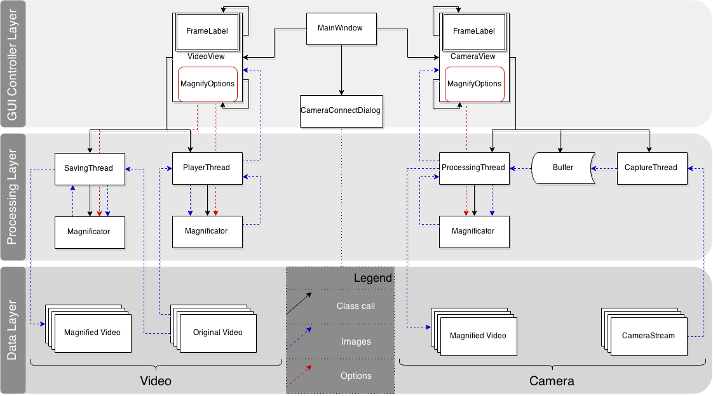
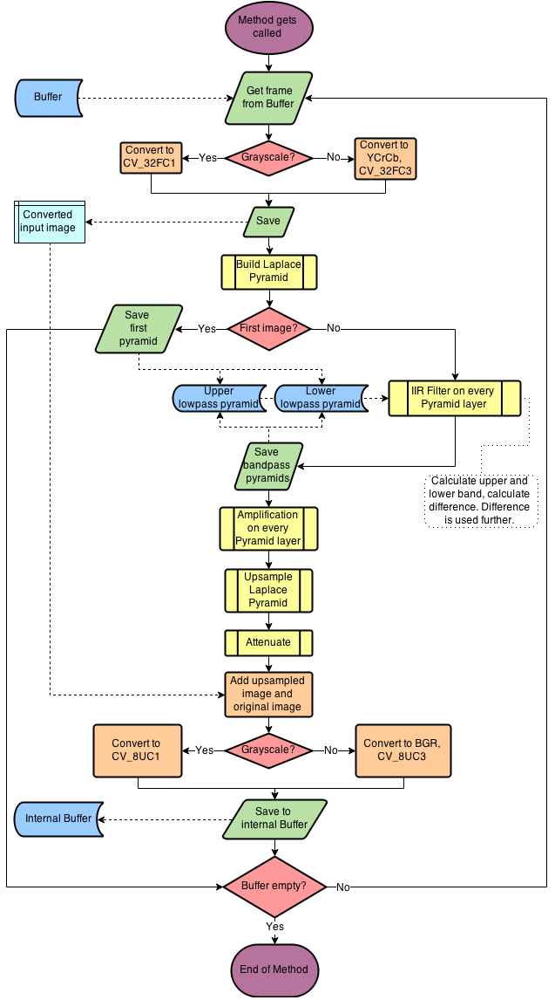

# Realtime-Video-Magnification
An OpenCV/Qt based realtime application to magnify motion and color in videos and camerastreams

## _UPDATE (31.10.2019)_
Added [Fast Phase Based Motion Magnification using Riesz Pyramids](https://people.csail.mit.edu/nwadhwa/riesz-pyramid/) using parts of [this repo](https://github.com/tbl3rd/Pyramids).
Works for videos, not yet tested for Live Webcams.

## Examples

*Image shows the color magnified output for a video. In the pictures you can see the effects of the cardiac cycle on the skins color. The upper image shows the skin of the face during a diastole, the lower one during a ventricular systole of the cycle.*

*(Un-)Wanted artifacts from a realtime motion magnified camerastream. The strong b/w areas around torso and head are resulting from a fast backwards movement and excessive amplification. The white points (the ones bigger than the noise) on the left side are awhirled dust particles, not visible in the original camera source.*

### Dependencies
- [Qt](http://qt-project.org/) >= 5.0
- [OpenCV](http://opencv.org/) >= 2.0 (< 3.0 ? -> not tested yet)

### License
This application is licensed under GPLv3, read the [LICENSE](LICENSE).

### Credits
Thanks to Nick D'Ademo whose [qt-opencv-multithreaded](https://github.com/nickdademo/qt-opencv-multithreaded) application 
served as basis and to Joseph Pan whose algorithms in the [QtEVM](https://github.com/wzpan/QtEVM) application were adapted
for this project.

Also take a look at the MITs webpage for [Eulerian Video Magnification](http://people.csail.mit.edu/mrub/vidmag/). 
They provide demo videos on their page and the team did a fantastic job in researching and developing this field of science.

# How do I use it?
### Connect
- Camera
    - Device Number: Type in the device number of your camera connected to your computer. Indexing starts with 0 which is usually your built-in webcam.
    - (Ubuntu/Linux) PointGrey Device on USB:  Having a DC1394 Camera connected to your computer, OpenCV redirects the camera over the v4l-API to device number 0. If you wish to also connect to your built-in camera, enable this option to set built-in to 0, DC1394 to 1
    - Image Buffer: Select the length of an image buffer before processing those images. If dropping frames if buffer is full is disabled, your capture rate will be same the same as your processing rate.
- Video
    - Choose a video. Compatibility is given if your computer supports the codec. Valid file endings are .avi .mp4 .m4v .mkv .mov .wmv
- Resolution: This does not work for videos on Ubuntu/Linux yet (Windows not tested). For cameras check the supported modes from camera manufacturer and type in the resolution specified for a mode.
- Frames per Second: Some cameras support multiple modes with different resolution/fps/etc. . Setting the framerate will change into a mode with a framerate near the one you typed in. For videos, some mp4-files have a bad header where OpenCV can't read out the framerate, which will normally be set to 30FPS. Anyway here you can set it manually.

### Main Window
When succesfully connected to a camera or opened a window, you can draw a box in the video, to scale and only amplify this Region Of Interest in a video source. Setting the video back to normal can be done via menu that opens with a right click in the video. There is also the option to show the unmagnified image besides the processed one.

### Magnify
Try experimenting with different option values. Furthermore tooltips are provided when hovering the cursor above a text label in the options tab. If you're using an older machine and processing is too slow, try enabling the Grayscale checkbox.

|                        |  Low *Level* value |  High *Level* value|
| :---------------------- | :-----------------: | :---------------: |
|**Color Magnification** | Slower and more accurate. Too low = no signal detection |  Faster magnification, inaccurate spatial resolution|
|**Motion Magnification**| More noise, less movements by big objects  |   Less noise, less movements by little objects |

#### Color Magnification
Note that in the scene, absolutely NO MOVEMENTS are required to process the video correctly.
- Amplification: The higher the value, the more colorful and noisy the output.
- Frequency Range: The freq. range of periodically appearing color changes that shall be amplified. 

#### Motion Magnification
- Amplification: The higher the value, the more movements and noise are amplified.
- Cutoff Wavelength: Reduces fast movements and noise.
- Frequency Range: Reducing the handler values leads to magnifying slow movements more than fast movements and vice versa.
- Chrom Attenuation: The higher the value, the more the chromaticity channels are getting amplified too, e.g. the more colorful the movements are.

### Save
For saving videos or recording from camera you have to specify the file extension by your own. .avi is well supported. If you should encounter problems, please try a differenct saving codec in the toolbar under File->Set Saving Codec.

# How does it work?
The image below provides you the class structure and the dataflow (blue = images, red = options) throughout the application.

### Algorithm
The algorithms are using a combination of spatial filters (e.g. image pyramids) and temporal filters to determine
motions of different spatial wavelength in videos. These can be amplified separately before collapsing the image pyramid
and adding the motion image back to the original.

#### Color Magnification
For further informations look at the comments in the .h/.cpp files in /main/magnification/*

#### Motion Magnification
For further informations look at the comments in the .h/.cpp files in /main/magnification/*

