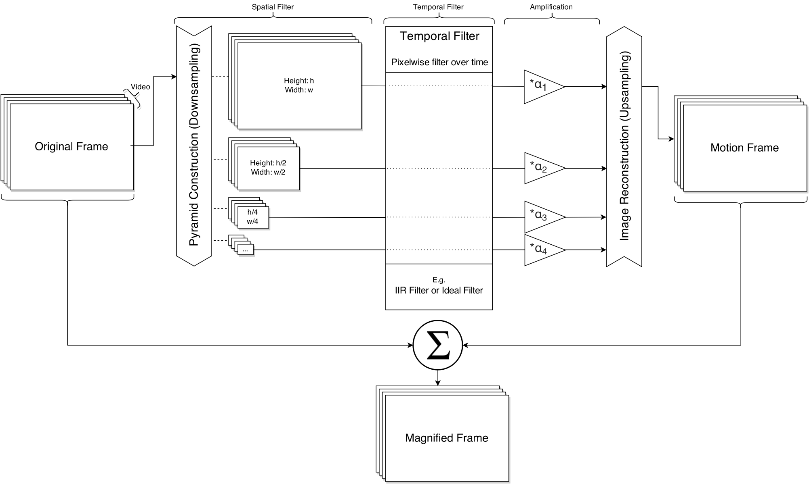

# Realtime-Video-Magnification
An OpenCV/Qt based realtime application to magnify motion and color in videos and camerastreams

## How does it work?
The algorithms are using a combination of spatial filters (e.g. image pyramids) and temporal filters to determine
motions of different spatial wavelength in videos. These can be amplified separately before collapsing the image pyramid
and adding the motion image.

### Color Magnification

### Motion Magnification

## Dependencies
- [Qt](http://qt-project.org/) >= 5.0
- [OpenCV](http://opencv.org/) >= 2.0 (< 3.0 ? -> not tested yet)

## License
This application is licensed under GPLv3, read the [LICENSE](LICENSE).

## Credits
Thanks to Nick D'Ademo, whose [qt-opencv-multithreaded](https://code.google.com/p/qt-opencv-multithreaded/) application 
served as basis and Joseph Pans [QtEVM](https://github.com/wzpan/QtEVM) application whose algorithms were adapted
for this project.

Also take a look at the MITs webpage for [Eulerian Video Magnification](http://people.csail.mit.edu/mrub/vidmag/). 
They also provide demo videos on their page and the team did a fantastic job in researching and developing this field of science. 
